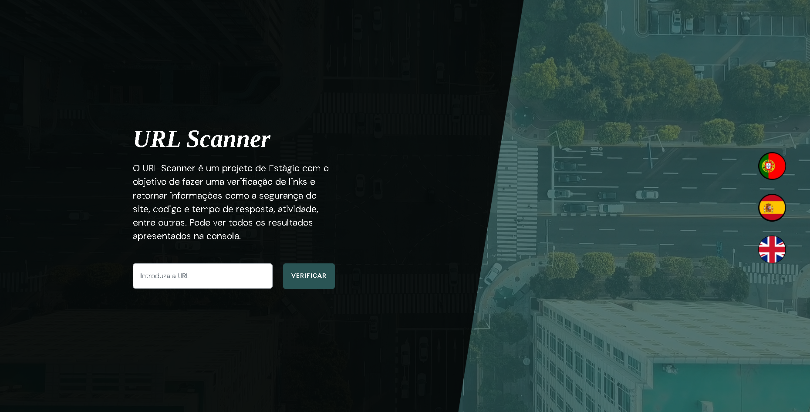
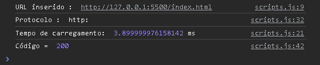

# Projeto-Estagio

<h1>URL Scanner</h1>

<h5>#pt</h5>

O URL Scanner é um projeto de Estágio com o objetivo de fazer uma verificação de links e retornar informações como a segurança do site, codigo e tempo de resposta, atividade, entre outras. Pode ver todos os resultados apresentados na consola.

 

<h5>#es</h5>

URL Scanner es un proyecto de prácticas diseñado para comprobar enlaces y devolver información como la seguridad del sitio, código y tiempo de respuesta, actividad y más. Puedes ver todos los resultados mostrados en la consola.

 

<h5>#en</h5>

URL Scanner is an internship project designed to check links and return information such as the site's security, code and response time, activity and more. You can see all the results displayed in the console.

<h5><a href="https://projeto-estagio-six.vercel.app" target="_blank">Ver Projéto</a></h5>

<h3>Projéto de Estági ( ERASMUS + Placencia-Espanha, Julho 2024) o Realizado por:</h3>
<h3> Alexandre Bento e Rodrigo Amaro, da turma de 2º Ano de Programador de Informática </h3>
<h3><a href="https://www.epfundao.edu.pt" target="_blank">Escola Profissional do Fundão</a></h3>

 
 
